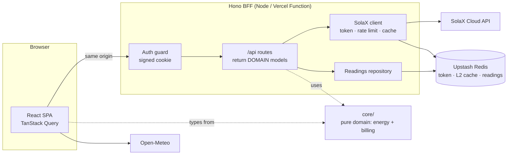

<div align="center">

# ☀️ Solar

**A personal dashboard for a SolaX photovoltaic plant, and for the CFE bill that comes with it.**

The official app shows raw numbers. This one digests them: live power flow, production curves,
self-sufficiency, the CFE *bolsa energética*, DAC risk and what the next bill will actually cost.


</div>

---

## Features

### Today
- **Live power gauge** scaled to the installed kWp, aware of sunrise and sunset (NOAA solar position, no API).
- **Animated energy flow**: particles move faster where more watts flow; the layout adapts to the
  discovered hardware (battery, meter, or neither).
- **Energy analysis** with Day / Month / Year / All views and floating tooltips.
- **Weather and expected production** from Open-Meteo shortwave radiation (free, no key, called from the browser).
- **Savings and impact**: today's savings at the real marginal tariff, lifetime CO₂ and equivalents.

### CFE
- **Meter readings** entered by hand, including meter swaps and their carryover.
- **Bolsa energética**: exported kWh banked FIFO and expiring on a rolling 12 months, as CFE applies it.
- **DAC risk**: 12-month moving average against the tariff's limit.
- **Bill history and projection**: tariff 1C blocks, IVA and CFE's minimum charge, verified against a real bill.
- **Closed energy balance**: PV + imported − exported gives the house load per period, even without a meter.

### System
- **Microinverter fleet**: each unit with its temperature, status and panels.
- **Active alarms** with SolaX's own handling suggestions.
- **Quota monitor**: token lifetime and SolaX API calls used against the daily budget.

### Experience
- Dark-only emerald theme, tabular numbers that don't jump, skeleton loaders shaped like their content.
- Animated login, reduced-motion aware.

---

## Architecture



**Why a server at all?** Two reasons, neither of them preference:

1. **The SolaX API has no CORS.** A browser cannot call it, not even from SolaX's own domain.
2. **The credentials control the inverter.** `client_credentials` grants `scope: all`, which includes
   export limits and battery modes. The secret must never reach a bundle.

**Design rules that carry the weight:**

- **`core/` is pure.** No React, Hono, Vite or I/O. Domain models, services and the SolaX mappers
  live there and are shared by the server and the browser.
- **The server returns domain, not DTOs.** SolaX payloads are validated with Zod and mapped once.
  Units, nulls and contradictory sign conventions never leak past the mappers.
- **Topology is discovered, not assumed.** Battery, meter and inverter count come from the API,
  and the dashboard composes itself from them.
- **Quota is a hard wall.** Local per-minute and per-day budgets, backoff on `10406`, an in-memory
  cache with an optional Redis L2, and polling that backs off when the dongle stops advancing.

```
core/            pure domain: energy/, billing/, solax/ (DTOs + mappers)
server/          Hono BFF: auth, routes, SolaX client, storage adapters
  create-server.ts   wires everything; shared by both entries
  index.ts           local Node entry (also serves dist/)
  vercel.ts          Vercel Function entry
src/             React SPA: app/, features/, ui/ (charts, primitives, tokens)
scripts/         Vercel Build Output, Upstash seeding
tests/           Vitest: domain, mappers, server
```

---

## Stack

| Layer | Choice |
|---|---|
| Front | Vite, React 19, TypeScript strict |
| Styles | Tailwind CSS v4 (CSS-first `@theme`) |
| Charts | D3 primitives (`d3-scale`, `d3-shape`) with hand-built SVG |
| Motion | `motion` |
| Data | TanStack Query v5 |
| Server | Hono on `@hono/node-server` |
| Validation | Zod |
| Storage | JSON file locally, Upstash Redis in production |
| Tests | Vitest |

---

## Getting started

Requires Node 22 and pnpm.

```bash
pnpm install
# create .env with the variables below
pnpm dev:server        # API on :8787
pnpm dev               # SPA on :5173, proxies /api
```

### Environment variables

| Variable | Required | Description |
|---|---|---|
| `SOLAX_CLIENT_ID` | ✅ | Developer Portal client id |
| `SOLAX_CLIENT_SECRET` | ✅ | Developer Portal client secret. Server-only |
| `SOLAX_BASE_URL` | | `https://openapi-eu.solaxcloud.com` (default) or the CN endpoint |
| `SOLAX_BUSINESS_TYPE` | | `1` residential (default) or `4` C&I |
| `SOLAX_MAX_CALLS_PER_MINUTE` | | Local budget, default `60` |
| `SOLAX_MAX_CALLS_PER_DAY` | | Local budget, default `20000` |
| `APP_USER` | prod | Login user (≥ 3 chars) |
| `APP_PASSWORD` | prod | Login password (≥ 12 chars) |
| `APP_SESSION_SECRET` | prod | Cookie signing key (≥ 32 chars): `openssl rand -hex 32` |
| `UPSTASH_REDIS_REST_URL` | prod | Upstash REST URL |
| `UPSTASH_REDIS_REST_TOKEN` | prod | Upstash REST token |
| `NODE_ENV` | | `production` on the deployed app |

The three `APP_*` variables go together: set all or none. Locally, with none set, the login is
disabled. **In production the app refuses every request until they are configured.**

---

## Authentication

A single owner, no user database. Credentials live in environment variables and a successful login
issues an HMAC-signed, `httpOnly`, `SameSite=Lax` cookie valid for 30 days. Comparisons are
constant-time, failures are delayed and throttled per IP, and rotating `APP_SESSION_SECRET` signs
everyone out.

---

## Deploy: Vercel + Upstash (free tier)

1. **Upstash**: create a Redis database and copy its REST URL and token.
2. **Seed the bill history** (optional, from your machine with the Upstash variables in `.env`):
   ```bash
   pnpm seed:upstash
   ```
3. **Vercel**: import the repository. `vercel.json` already sets the install and build commands;
   the build emits the SPA as static files and the API as one Node function via the Build Output API.
4. Add the environment variables above in *Project → Settings → Environment Variables* and deploy.

The Hobby plan has no card on file and pauses the project if a limit is ever reached; it never bills.
Polling is tuned to stay far below the limits (the connection panel only polls while it is open).

---

## Testing

```bash
pnpm typecheck
pnpm test
```

The domain is tested against fixtures captured from the real API: load derivation, sign
conventions, the bolsa's FIFO expiry, tariff blocks and the minimum charge, auth and sessions.

---

## License

See [LICENSE](LICENSE).
